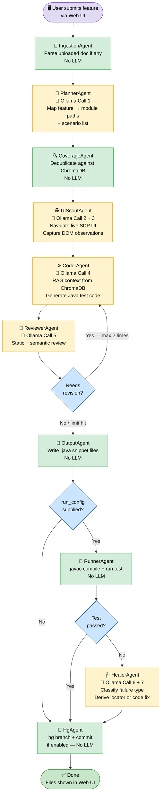

# AI Automation QA — Pipeline Flow & Architecture

> **Last updated:** February 27, 2026  
> **Active model:** `qwen2.5-coder:7b` via Ollama (localhost:11434)  
> **Entry point:** Web UI at `http://localhost:9500`

---

## Overview

The pipeline is a **LangGraph state machine** with 9 agents chained in sequence.  
Each agent reads from a shared `AgentState` dict, does its work, writes results back, and passes control to the next agent.

Out of 9 agents, **5 call Ollama** (the local LLM) and **4 do not** — they use rule-based logic, file I/O, or subprocess calls instead.

---

## Flow Diagram


```mermaid
flowchart TD
    A([🖥️ User submits feature\nvia Web UI]) --> B

    B[📄 IngestionAgent\nParse uploaded doc if any\nNo LLM] --> C

    C[📝 PlannerAgent\n🤖 Ollama Call 1\nMap feature → module paths\n+ scenario list] --> D

    D[🔍 CoverageAgent\nDeduplicate against ChromaDB\nNo LLM] --> E

    E[🕵️ UIScoutAgent\n🤖 Ollama Call 2 + 3\nNavigate live SDP UI\nCapture DOM observations] --> F

    F[⚙️ CoderAgent\n🤖 Ollama Call 4\nRAG context from ChromaDB\nGenerate Java test code] --> G

    G[🔎 ReviewerAgent\n🤖 Ollama Call 5\nStatic + semantic review] --> H{Needs\nrevision?}

    H -->|Yes — max 2 times| F
    H -->|No / limit hit| I

    I[💾 OutputAgent\nWrite .java snippet files\nNo LLM] --> J{run_config\nsupplied?}

    J -->|No| M
    J -->|Yes| K

    K[🧪 RunnerAgent\njavac compile + run test\nNo LLM] --> L{Test\npassed?}

    L -->|Yes| M
    L -->|No| N

    N[🩺 HealerAgent\n🤖 Ollama Call 6 + 7\nClassify failure type\nDerive locator or code fix] --> M

    M[🔀 HgAgent\nhg branch + commit\nif enabled — No LLM] --> O

    O([✅ Done\nFiles shown in Web UI])

    style B  fill:#d4edda,stroke:#28a745,color:#000
    style D  fill:#d4edda,stroke:#28a745,color:#000
    style I  fill:#d4edda,stroke:#28a745,color:#000
    style K  fill:#d4edda,stroke:#28a745,color:#000
    style M  fill:#d4edda,stroke:#28a745,color:#000
    style C  fill:#fff3cd,stroke:#e6a817,color:#000
    style E  fill:#fff3cd,stroke:#e6a817,color:#000
    style F  fill:#fff3cd,stroke:#e6a817,color:#000
    style G  fill:#fff3cd,stroke:#e6a817,color:#000
    style N  fill:#fff3cd,stroke:#e6a817,color:#000
    style H  fill:#cce5ff,stroke:#004085,color:#000
    style J  fill:#cce5ff,stroke:#004085,color:#000
    style L  fill:#cce5ff,stroke:#004085,color:#000
    style A  fill:#e2d9f3,stroke:#6f42c1,color:#000
    style O  fill:#c8e6c9,stroke:#2e7d32,color:#000
```

**Legend**

| Colour | Meaning |
|--------|---------|
| 🟡 Yellow | Agent calls Ollama (LLM) |
| 🟢 Green | Agent uses rule-based logic / file I/O / subprocess — no LLM |
| 🔵 Blue | Decision / routing point |
| 🟣 Purple | External entry / exit |

---

## Agent-by-Agent Explanation

### 1 · IngestionAgent — `agents/ingestion_agent.py`
**No LLM**

**What it does:**  
If the user uploaded a document (PDF, DOCX, XLSX, TXT) alongside the feature description, this agent parses it and extracts structured use-cases, enriching the feature description and suggesting target modules.  

If no document was uploaded (text-only flow), it is a **no-op** — it immediately passes control to the next agent.

**Input → Output:**
- Input: `source_document` path (optional)
- Output: enriched `feature_description`, populated `target_modules`

---

### 2 · PlannerAgent — `agents/planner_agent.py`
**🤖 Ollama Call #1**

**What it does:**  
This is the first brain of the pipeline. It takes the feature description and the SDP ITSM module taxonomy (`config/module_taxonomy.yaml`) and asks the LLM to figure out:
- Which module path(s) the feature belongs to (e.g., `modules/requests/request/`)
- What specific test scenarios should be generated (create, edit, delete, validate, etc.)

**What Ollama is asked:**  
> *"Given this ITSM feature description and the available module taxonomy, produce a JSON test plan: `{ "module/path": [{ "description": ..., "type": ..., "priority": ... }] }`"*

**Input → Output:**
- Input: `feature_description`, `target_modules` (optional hint)
- Output: `test_plan` — a dict mapping each module path to a list of scenario specs

**Why it's critical:**  
Everything downstream depends on this. If the LLM produces an empty or wrong `test_plan`, no code gets generated. This is also the most memory-intensive step — Ollama needs **4.3 GiB RAM** loaded to answer.

---

### 3 · CoverageAgent — `agents/coverage_agent.py`
**No LLM — uses ChromaDB vector search**

**What it does:**  
Before generating code for a scenario, this agent queries the ChromaDB knowledge base (14,637 vectors from 17,101 existing scenarios across 210 modules) to check if a similar test already exists.

- If a scenario is **too similar** to an existing one → it is marked as a duplicate and skipped
- If it is **genuinely new** → it passes through as a coverage gap

This prevents generating redundant tests that are already in the codebase.

**Input → Output:**
- Input: `test_plan` from PlannerAgent
- Output: `coverage_gaps` (new scenarios), `duplicate_warnings`, filtered `proposed_scenarios`

---

### 4 · UIScoutAgent — `agents/ui_scout_agent.py`
**🤖 Ollama Call #2 + #3**

**What it does:**  
Before writing any code, the agent uses **Playwright** to open a real browser, navigate to the actual SDP application, and observe the live UI for each target module.

It captures an **accessibility snapshot** (DOM tree of buttons, inputs, labels, and their states) from the real running SDP instance.

**Two Ollama calls are made here:**

- **Call #2 — Scout plan inference:**  
  For modules with no pre-defined navigation plan, asks Ollama:  
  > *"For the module path `modules/requests/request/`, what are the step-by-step UI navigation steps to reach the form?"*

- **Call #3 — DOM annotation:**  
  After Playwright captures the snapshot, asks Ollama:  
  > *"Here is the DOM snapshot of the page. What are the actionable UI observations — which fields are visible, which buttons trigger what, what state changes happen?"*

**Input → Output:**
- Input: `proposed_scenarios` (to know which modules to scout)
- Output: `ui_observations` — a dict of `{ module_path: [UIObservation] }` injected into the Coder's prompt

**Why it matters:**  
This gives the CoderAgent live ground truth about the UI instead of relying purely on outdated examples from the knowledge base.

---

### 5 · CoderAgent — `agents/coder_agent.py`
**🤖 Ollama Call #4 (once per module)**

**What it does:**  
This is the primary code generation step. For each module in the `test_plan`, it:

1. **Retrieves RAG context** from ChromaDB — fetches the 3 most similar existing test implementations as examples
2. **Fetches help guide snippets** — field definitions, locator patterns specific to the module
3. **Injects the UI observations** from UIScoutAgent as additional context
4. **Asks Ollama** to generate the Java `@AutomaterScenario` method(s)

**What Ollama is asked:**  
> *"Here are framework rules, similar existing tests, live UI observations, and the scenarios to implement. Generate the Java `@AutomaterScenario` annotated method and the corresponding `Base.java` logic."*

The output must follow a **two-piece format**:
```
// ===== ADD TO: IncidentRequestBase.java =====
<method body>

// ===== ADD TO: IncidentRequest.java =====
<@AutomaterScenario wrapper>
```

**Input → Output:**
- Input: `test_plan`, `ui_observations`
- Output: `generated_code` list — one entry per module with the raw Java code string

---

### 6 · ReviewerAgent — `agents/reviewer_agent.py`
**🤖 Ollama Call #5 (once per module)**

**What it does:**  
Runs in two phases for the generated code:

**Phase A — Static checks (no LLM):**
- Are required imports present (`EntityCase`, `SDPCloudActions`, etc.)?
- Is `@AutomaterScenario` annotation present with required fields?
- Do method signatures match the framework conventions?
- Are data key references valid?

**Phase B — Semantic review (Ollama):**  
> *"Does this code correctly implement the described scenario? Does it follow the framework patterns? Are there logic errors or missing steps?"*

If issues are found, it populates `revision_requests` with specific fix instructions.

**The revision loop:**  
If `revision_requests` is non-empty AND `revision_count < 2`, the pipeline **routes back to CoderAgent** with the fix notes injected into the prompt. This gives the LLM up to 2 chances to self-correct before proceeding regardless.

**Input → Output:**
- Input: `generated_code`
- Output: `review_results`, `revision_requests`

---

### 7 · OutputAgent — `agents/output_agent.py`
**No LLM — file I/O**

**What it does:**  
Parses the two-piece format from CoderAgent's output and writes the Java snippet files to disk under a timestamped run directory:

```
generated/
  <timestamp>_<module_name>/
    IncidentRequestBase_snippet.java
    IncidentRequest_snippet.java
    summary.json
```

Also collects `generation_instructions` — copy-paste-ready terminal commands telling the developer which files to patch in the real project.

**Input → Output:**
- Input: `generated_code`, `review_results`
- Output: `final_output_paths`, `generated_dir`, `generation_instructions`

---

### 8 · RunnerAgent — `agents/runner_agent.py`
**No LLM — Java subprocess**  
**Only activated if `run_config` is provided**

**What it does:**  
Compiles and executes the generated test against the live SDP instance:

1. `javac` targeted compile of just the two patched files
2. Patches `StandaloneDefault.java` with the test class and method
3. Runs `run_test.py` as a subprocess
4. Captures stdout, parses for `$$Failure` / `"successfully"` / exceptions
5. Returns `run_result { success: bool, stdout: str, summary: str }`

**Input → Output:**
- Input: `run_config` (url, email, entity_class, method_name)
- Output: `run_result`

---

### 9 · HealerAgent — `agents/healer_agent.py`
**🤖 Ollama Call #6 + #7**  
**Only activated if RunnerAgent ran AND test failed**

**What it does:**  
Attempts to automatically fix the failing test without human intervention.

**Call #6 — Failure classification:**  
> *"The test output is: `[stdout]`. Is this a LOCATOR failure, API failure, LOGIC failure, or OTHER?"*

**Call #7 — Fix derivation:**
- **LOCATOR failure:** Playwright navigates to the failing page, captures a fresh accessibility snapshot, then asks Ollama:  
  > *"The old XPath `//button[@id='save']` no longer works. Here is the current DOM. What is the correct XPath or `By` locator?"*
- **API / LOGIC failure:** Asks Ollama to generate a code patch based on the error output.

After deriving the fix, Healer patches the Java source, recompiles, and reruns. The result is stored in `heal_result`.

---

### 10 · HgAgent — `agents/hg_agent.py`
**No LLM — VCS operations**  
**Gated by `HG_AGENT_ENABLED` flag (currently `False`)**

**What it does:**  
When enabled, creates a Mercurial branch named after the run and commits all generated files. This gives every auto-generated test its own traceable branch in the SDP source repository.

---

## Where Ollama Is Used — Summary

| Ollama Call | Agent | Prompt Purpose | When skipped |
|-------------|-------|---------------|--------------|
| **#1** | PlannerAgent | Feature → JSON test plan | Never (always runs) |
| **#2** | UIScoutAgent | Infer navigation plan for unknown module | Module has a pre-built scout plan |
| **#3** | UIScoutAgent | DOM snapshot → actionable UI observations | Playwright fails to reach page |
| **#4** | CoderAgent | Generate Java `@AutomaterScenario` code | If test_plan is empty (e.g. OOM in #1) |
| **#5** | ReviewerAgent | Semantic code review | If generated_code is empty |
| **#6** | HealerAgent | Classify failure type | Test passed, or RunnerAgent not run |
| **#7** | HealerAgent | Derive XPath fix or code patch | Test passed, or failure is OTHER type |

**Maximum LLM calls in a full run: 7**  
**Minimum LLM calls (code-gen only, happy path): 3** (Planner + Coder + Reviewer)

---

## State Flow Between Agents

```
AgentState (shared dict)
│
├── feature_description     ← set by user / enriched by IngestionAgent
├── test_plan               ← written by PlannerAgent
├── coverage_gaps           ← written by CoverageAgent
├── ui_observations         ← written by UIScoutAgent
├── generated_code          ← written by CoderAgent
├── review_results          ← written by ReviewerAgent
├── revision_requests       ← written by ReviewerAgent (triggers loop back)
├── revision_count          ← incremented by pipeline router
├── final_output_paths      ← written by OutputAgent
├── generation_instructions ← written by OutputAgent
├── run_result              ← written by RunnerAgent
├── heal_result             ← written by HealerAgent
├── hg_result               ← written by HgAgent
├── messages                ← appended by every agent (streamed to UI)
└── errors                  ← appended on failure (streamed to UI)
```

> All `messages` and `errors` fields use `Annotated[list[str], operator.add]` — LangGraph's reducer automatically accumulates entries across nodes. Each agent only needs to return the **new** messages it wants to add.

---

## External Dependencies

| Service | Role | Used by |
|---------|------|---------|
| **Ollama** `localhost:11434` | Local LLM inference (`qwen2.5-coder:7b`, 4.3 GiB) | Planner, UIScout, Coder, Reviewer, Healer |
| **ChromaDB** `knowledge_base/chroma_db/` | Vector similarity search — 14,637 scenario vectors | Coverage, Coder |
| **Playwright** (Chromium) | Live browser for UI observation and self-healing | UIScout, Healer |
| **SDP Application** `sdpodqa-auto1.csez.zohocorpin.com:9090` | Target app for UI scouting and test execution | UIScout, Runner, Healer |
| **Mercurial** `hg` | Source control for generated tests | HgAgent (gated off) |

---

## Known Constraints

| Constraint | Detail |
|------------|--------|
| **RAM** | Ollama needs 4.3 GiB free to load `qwen2.5-coder:7b`. If available RAM < 4.3 GiB, PlannerAgent fails with OOM and the pipeline produces no output. |
| **Speed** | All inference is CPU-only. A full pipeline run takes **15–25 minutes** on this machine. |
| **Revision cap** | The Reviewer → Coder loop is capped at **2 revisions** to prevent infinite loops. After 2 cycles, whatever code exists is passed to OutputAgent regardless. |
| **Runner opt-in** | RunnerAgent only activates if `run_config` is included in the initial state. The Web UI does not send `run_config` by default — test execution is a separate step. |
| **HgAgent gated** | `HG_AGENT_ENABLED = False` in `config/project_config.py`. Set to `True` to enable auto-branch + commit. |

---

## Roadmap

### Phase 4.5 — Run-Once Validation + UI Copy-Paste Panel 🔲

**Goal:** After code generation, let the user validate the generated test with a single click and copy the final `.java` files directly from the Web UI — no manual `scp` / file browsing needed.

#### What needs to be built

| Item | Location | Detail |
|------|----------|--------|
| **"Run after generation" toggle** | Web UI (`web/static/index.html`) | Checkbox on the generate form. When checked, sends `run_once=true` in the `POST /api/generate` body |
| **`run_config` auto-population** | `web/server.py` → `_run_pipeline_thread` | When `run_once=true`, build a minimal `run_config` from the generated entity class name and method name (extracted from `final_output_paths`) and inject it into initial state |
| **RunnerAgent single-run** | `agents/pipeline.py` `route_after_output` | Already routes to `runner` when `run_config` present. No change needed. |
| **Copy-Paste panel in UI** | `web/static/index.html` | After run completes, for each file in `final_output_paths`:<br>• Show filename as a tab/card<br>• Syntax-highlighted `<pre>` block with full file contents<br>• **"Copy file"** button (Clipboard API)<br>• Run result badge (✅ PASSED / ❌ FAILED) next to each file |
| **`GET /api/runs/{run_id}/file-content`** | `web/server.py` | New endpoint — returns the raw text content of a generated file by path, so the UI can render it without a file download |
| **Destination path hint** | UI copy-paste panel | Show the exact target path where the file should be placed in `$PROJECT_NAME/src/...` so the developer knows where to paste |

#### User journey (after this phase)
```
1. Paste feature description (or upload doc) → hit Generate
2. Check "Run once to validate" ☑
3. Pipeline runs: generate → compile → execute test
4. Generated file panel appears:
   ┌─────────────────────────────────────────────────────┐
   │  SolutionBase.java  ✅ PASSED                        │
   │  [Copy file ▾]  Target: modules/solutions/solution/  │
   │  ┌──────────────────────────────────────────────┐   │
   │  │ public void createSolution() {               │   │
   │  │     super.createSolution();                  │   │
   │  │ }                                            │   │
   │  └──────────────────────────────────────────────┘   │
   └─────────────────────────────────────────────────────┘
5. Developer copies → pastes into module src → commits to Hg
```

#### Files to touch
- `web/server.py` — add `GET /api/runs/{run_id}/file-content`, populate `run_config` when `run_once=true`
- `web/static/index.html` — "Run once" toggle, copy-paste panel, Clipboard API, target-path hint
- `agents/pipeline.py` — no changes needed (routing already correct)
- `config/project_config.py` — optionally add `RUN_ONCE_DEFAULT = False`

---

### Phase 8 — Shared Central ChromaDB (Team-Wide Dedup) 🔲

**Goal:** Eliminate cross-person duplicate generation when multiple team members submit the same or similar feature documents.

#### Problem (why this matters)
Today, each person runs a **local** `knowledge_base/chroma_db/`. The CoverageAgent only blocks duplicates it has already seen *on that machine*. If Person A generates scenarios for Feature X and Person B later submits the same document, Person B's CoverageAgent has no knowledge of Person A's output → same scenarios are generated again.

#### Architecture
```
Shared ChromaDB server  (always-on internal machine)
       │
       ├── Nightly cron: rag_indexer.py --reset  (full reindex from Mercurial)
       │   → keeps the base of ~17,101 existing scenarios always fresh
       │
       └── Live upserts from OutputAgent  (after every successful generation)
           → newly generated scenarios visible to every team member immediately

Each person's tool:
  CoverageAgent  →  queries shared server  (reads)
  OutputAgent    →  upserts to shared server (writes, with lock)
```

#### What needs to be built

| Item | File | Detail |
|------|------|--------|
| `CHROMA_SERVER_URL` config | `config/project_config.py` | `None` by default → falls back to local `persist_dir`. Set to `http://<host>:8000` to use shared server. |
| `VectorStore` mode switch | `knowledge_base/vector_store.py` | If `CHROMA_SERVER_URL` is set, use `chromadb.HttpClient(host, port)` instead of `PersistentClient(persist_dir)` |
| Write lock for concurrent upserts | `knowledge_base/rag_server.py` | Add a per-collection async lock around upsert endpoint so two OutputAgents don't corrupt the index simultaneously |
| Nightly cron job | crontab on shared server | `0 2 * * * .venv/bin/python knowledge_base/rag_indexer.py --reset` — runs at 2 AM daily |
| Pipeline run serialization (bonus) | `web/server.py` | Optional: serialize concurrent `/api/generate` calls per-module to prevent two pipelines racing on the same Java file |

#### Fallback behaviour
- If `CHROMA_SERVER_URL` is not set (or server unreachable) → silently fall back to local `persist_dir` → same behaviour as today
- No breaking changes for single-developer use

#### Files to touch
- `config/project_config.py` — add `CHROMA_SERVER_URL`
- `knowledge_base/vector_store.py` — HttpClient branch
- `knowledge_base/rag_server.py` — write lock
- `agents/coverage_agent.py` — no change needed (uses VectorStore abstraction)
- `agents/output_agent.py` — no change needed (uses VectorStore abstraction)
